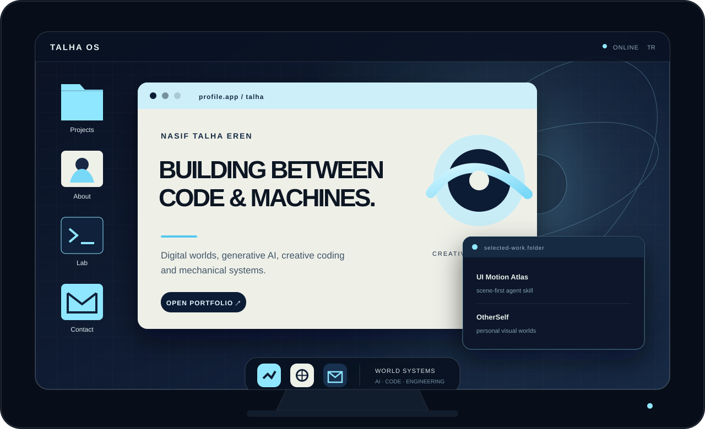

<p align="center">
  <a href="https://nasif-talha-eren-v2.bacinizikucagimaalim.chatgpt.site">
    
  </a>
</p>

<p align="center">
  <a href="https://nasif-talha-eren-v2.bacinizikucagimaalim.chatgpt.site"><strong>Open Portfolio</strong></a>
  &nbsp;&nbsp;·&nbsp;&nbsp;
  <a href="https://github.com/Talhaer/ui-motion-atlas">UI Motion Atlas</a>
  &nbsp;&nbsp;·&nbsp;&nbsp;
  <a href="mailto:talhaeren1016@gmail.com">Email</a>
  &nbsp;&nbsp;·&nbsp;&nbsp;
  <a href="#english">English</a>
</p>

<br>

<table>
  <tr>
    <td width="50%" valign="top">
      <h3>◉ profile.app</h3>
      <p>
        Selçuk Üniversitesi'nde <strong>Makine Mühendisliği</strong> okuyorum.
        Dijital dünyalar, üretken yapay zekâ ürünleri ve yaratıcı kodlama sistemleri geliştiriyorum.
      </p>
      <p>
        Yazılım ve yapay zekâ deneyimini fiziksel sistemler ve mühendislikle birleştiren işler
        üretmek istiyorum.
      </p>
    </td>
    <td width="50%" valign="top">
      <h3>⌁ currently-building.app</h3>
      <p><strong>World Systems</strong><br>Topluluk, ekonomi ve performans çevresinde yaşayan Minecraft sunucu sistemleri.</p>
      <p><strong>OtherSelf</strong><br>Kullanıcı fotoğraflarını kişisel görsel dünyalara dönüştüren AI ürünü.</p>
      <p><strong>Assembly</strong><br>Fikirlerden yeniden kullanılabilir arayüz bileşenleri üreten deneysel AI aracı.</p>
    </td>
  </tr>
</table>

<br>

<table>
  <tr>
    <td width="33%" valign="top">
      <h3>UI Motion Atlas</h3>
      <p>AI tarafından üretilen arayüzlerde efektlerden önce bütün sayfanın sanat yönetimini kuran açık kaynak Agent Skill.</p>
      <p><a href="https://github.com/Talhaer/ui-motion-atlas">Repository →</a></p>
    </td>
    <td width="33%" valign="top">
      <h3>Digital Worlds</h3>
      <p>Topluluk davranışı, ekonomi, performans ve uzun ömürlü oyun sistemleri üzerine çalışmalar.</p>
      <p><code>systems</code> <code>communities</code></p>
    </td>
    <td width="33%" valign="top">
      <h3>Physical Futures</h3>
      <p>Yazılım, yapay zekâ ve makine mühendisliğinin aynı ürün içinde buluşabileceği deneyler.</p>
      <p><code>AI</code> <code>mechanical</code></p>
    </td>
  </tr>
</table>

<br>

```text
talha@world-machine:~$ current_focus
→ Digital World Systems
→ Generative AI
→ Creative Coding
→ Content Workflows
→ Mechanical Engineering
```

> Kod, görüntü ve makineler arasında çalışan sistemler tasarlıyorum.

---

<details id="english">
  <summary><strong>English profile</strong></summary>
  <br>

  I am a **Mechanical Engineering student at Selçuk University**, working across digital worlds,
  generative AI products, and creative coding systems.

  My practice began with Minecraft server systems and now extends into AI-assisted visual
  production, content workflows, and tools that generate interface components. My long-term
  direction is to connect software and AI with physical systems and engineering.

  **Current work**

  - **World Systems:** living Minecraft server systems shaped around community, economy, and performance.
  - **OtherSelf:** an AI product in development that transforms personal photos into individual visual worlds.
  - **Assembly:** an experimental AI tool focused on turning ideas into reusable interface components.
  - **UI Motion Atlas:** a scene-first Agent Skill for original, motion-rich frontend design.
</details>

<br>

<p align="center">
  <strong>Open to internships, creative technology projects, and selected collaborations.</strong>
  <br><br>
  <a href="mailto:talhaeren1016@gmail.com">talhaeren1016@gmail.com</a>
</p>
