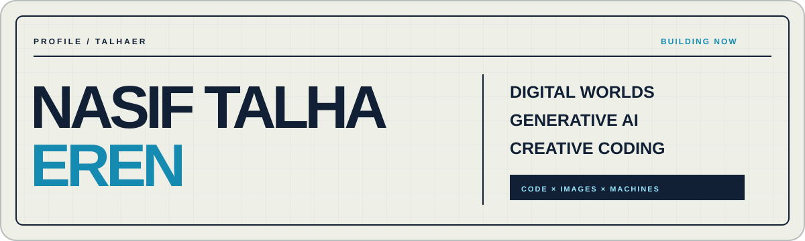

  

  <a href="https://nasif-talha-eren-v2.bacinizikucagimaalim.chatgpt.site">Portfolio</a>
  &nbsp;·&nbsp;
  <a href="mailto:talhaeren1016@gmail.com">Email</a>
  &nbsp;·&nbsp;
  <a href="#english">English</a>

## Merhaba, ben Talha.

Selçuk Üniversitesi'nde **Makine Mühendisliği** okuyorum. Dijital dünyalar, üretken yapay zekâ ürünleri ve yaratıcı kodlama sistemleri geliştiriyorum.

Üretim pratiğim Minecraft sunucu sistemleriyle başladı; bugün AI destekli görsel üretim, içerik iş akışları ve arayüz bileşenleri üreten araçlara uzanıyor. Uzun vadede yazılım ve yapay zekâ deneyimimi fiziksel sistemler ve mühendislikle birleştirmek istiyorum.

### Üzerinde çalıştıklarım

- **World Systems** — Topluluk, ekonomi ve performans çevresinde yaşayan Minecraft sunucu sistemleri.
- **OtherSelf** — Kullanıcı fotoğraflarını kişisel görsel dünyalara dönüştüren, geliştirme aşamasındaki AI ürünü.
- **Assembly** — Fikirlerden yeniden kullanılabilir arayüz bileşenleri üretmeye odaklanan deneysel AI aracı.

### Çalışma alanlarım

`Digital World Systems` · `Generative AI` · `Creative Coding` · `Content Workflows` · `Mechanical Engineering`

> Kod, görüntü ve makineler arasında çalışan sistemler tasarlıyorum.

---

<h2 id="english">Hello, I'm Talha.</h2>

I am a **Mechanical Engineering student at Selçuk University**, building across digital worlds, generative AI products and creative coding systems.

My practice began with Minecraft server systems and now extends into AI-assisted visual production, content workflows and tools that generate interface components. My long-term direction is to connect software and AI with physical systems and engineering.

### Current work

- **World Systems** — Living Minecraft server systems shaped around community, economy and performance.
- **OtherSelf** — An AI product in development that transforms personal photos into individual visual worlds.
- **Assembly** — An experimental AI tool focused on turning ideas into reusable interface components.

### Focus

`Digital World Systems` · `Generative AI` · `Creative Coding` · `Content Workflows` · `Mechanical Engineering`

  <strong>Open to internships, creative technology projects and selected collaborations.</strong> 
  <a href="mailto:talhaeren1016@gmail.com">talhaeren1016@gmail.com</a>

